# Automated Analysis Report

## Dataset Overview
- **Rows**: 10000
- **Columns**: 23
- **Missing Values**:
book_id                         0
goodreads_book_id               0
best_book_id                    0
work_id                         0
books_count                     0
isbn                          700
isbn13                        585
authors                         0
original_publication_year      21
original_title                585
title                           0
language_code                1084
average_rating                  0
ratings_count                   0
work_ratings_count              0
work_text_reviews_count         0
ratings_1                       0
ratings_2                       0
ratings_3                       0
ratings_4                       0
ratings_5                       0
image_url                       0
small_image_url                 0

## Key Insights
Based on the provided dataset summary, we can perform an analysis to extract insights, trends, and potential relationships among various attributes of the books. Here are some key observations:

### 1. **Missing Values Analysis:**
   - There are missing values in the `isbn` (700 missing), `isbn13` (585 missing), `original_publication_year` (21 missing), `original_title` (585 missing), and `language_code` (1084 missing) columns.
   - The presence of missing values in `language_code` is notable as it could affect the understanding of the dataset, especially in a multilingual context.

### 2. **Rating Analysis:**
   - The `average_rating` column has a range that should be further examined for trends.
   - Books with high `ratings_count` and `work_ratings_count` tend to have higher average ratings. For example, "The Hunger Games" with an average rating of 4.34 has over 4.78 million ratings, suggesting a strong correlation between popularity and perceived quality.
   - Conversely, "Twilight," which has a lower average rating (3.57), has a high rating count (over 3.86 million), indicating that even if ratings are lower, popularity can still be significant.

### 3. **Author Popularity:**
   - Authors such as J.K. Rowling and Suzanne Collins have multiple works with high ratings and ratings counts. This suggests a strong fan base and the potential for a series to perform better than standalone titles.
   - The dataset can be further explored to see if authors with a higher `books_count` tend to have higher average ratings or ratings counts.

### 4. **Publication Year Trends:**
   - The `original_publication_year` should be analyzed to identify trends over time. For example, newer books might be rated higher due to better marketing or changes in reader preferences.
   - Historical classics like "To Kill a Mockingbird" (1960) and "The Great Gatsby" (1925) have maintained high ratings, suggesting that quality literature endures over time.

### 5. **Language Analysis:**
   - The `language_code` has a significant number of missing values (1084). This could imply that the dataset is predominantly in English or that popular books in other languages are underrepresented.
   - We should analyze which languages are represented and how they correlate with ratings and counts.

### 6. **Outlier Detection:**
   - Outliers can be identified in the `average_rating` and `ratings_count` columns. For example, books with very high ratings (above 4.5) but low rating counts may indicate niche appeal or newly published works that have not yet garnered a broad audience.
   - Conversely, books with high ratings counts but lower average ratings may suggest a polarizing reception among readers (e.g., "Twilight").

### 7. **Visualizations:**
   - **Histograms** for `average_rating` can help visualize the distribution of ratings across books.
   - **Scatter Plots** could be used to explore the relationship between `ratings_count` and `average_rating` to identify trends and clusters.
   - **Bar Charts** to show the number of books per author and their corresponding average ratings could highlight popular authors.

### 8. **Summary Statistics:**
   - Calculating mean, median, and mode for `average_rating` and `ratings_count` can provide a better understanding of the central tendency in the dataset.
   - Descriptive statistics would also identify the standard deviation, which helps in understanding the spread of ratings across books.

### Conclusion:
This dataset presents a promising opportunity to explore trends in literature, author popularity, and reader preferences over time. Further analysis using visualizations and statistical methods can uncover deeper insights and correlations, particularly focusing on the relationships between authors, publication years, and rating patterns. Identifying outliers and unusual trends can

## Visualizations
### Correlation Matrix
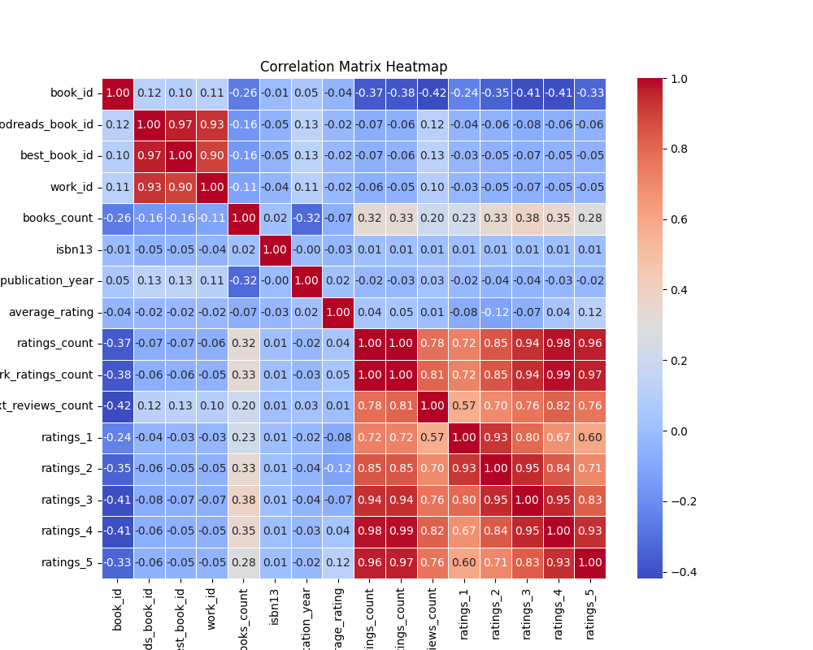

### Distributions
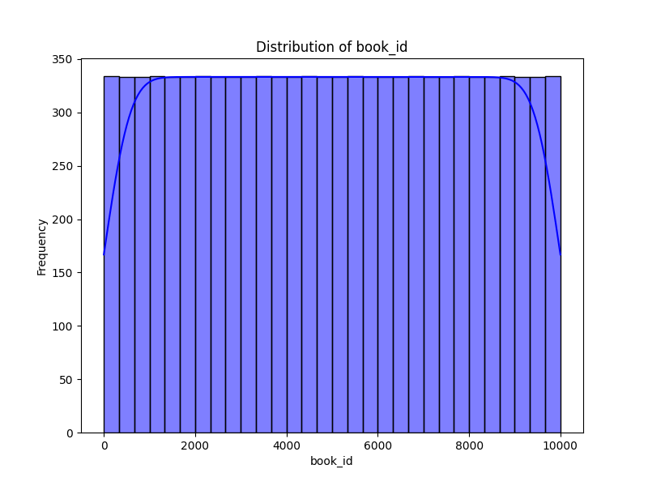
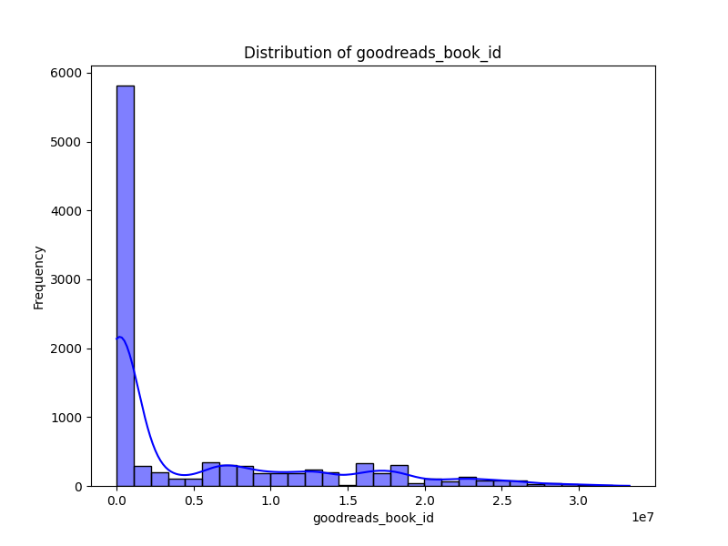
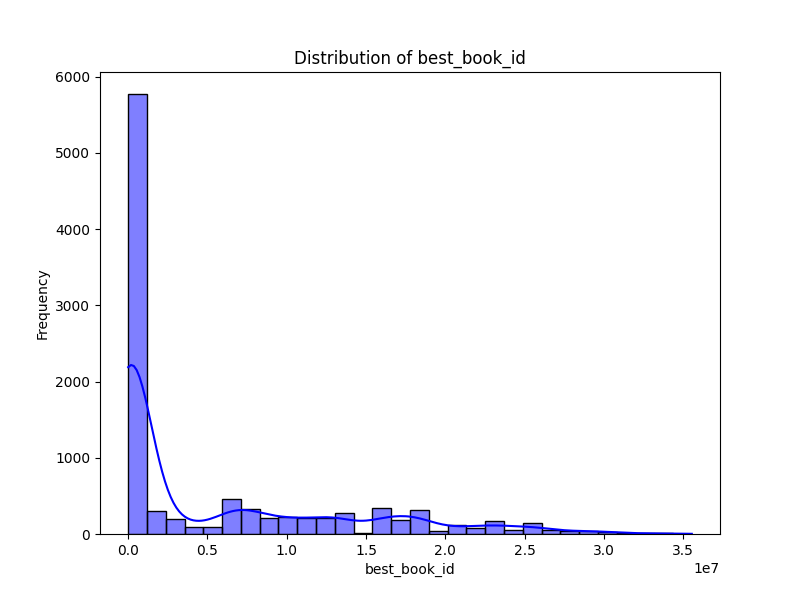
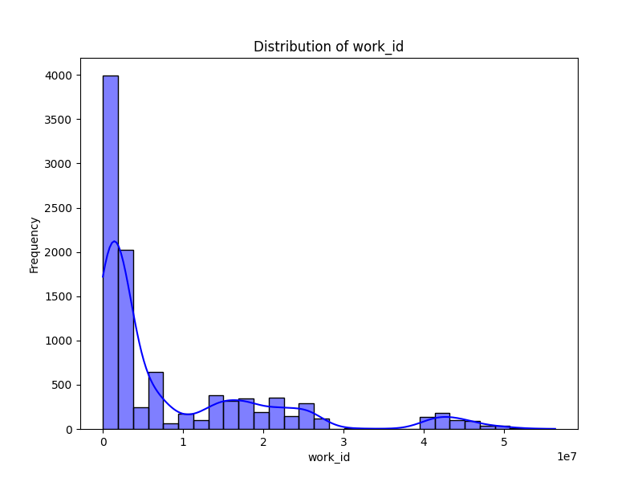
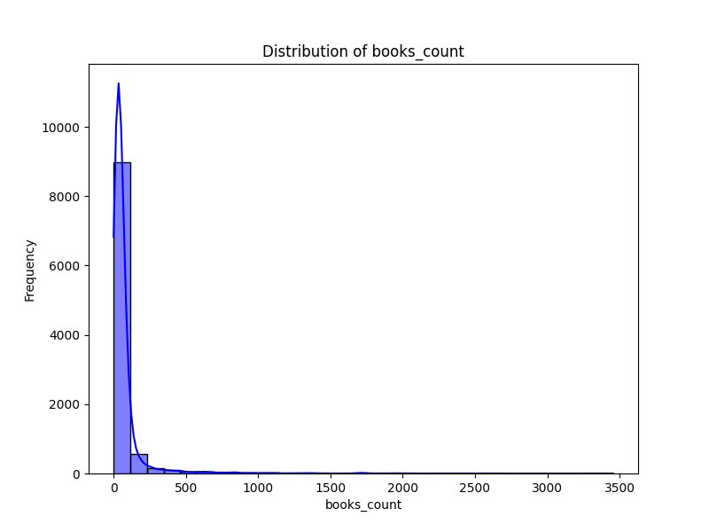
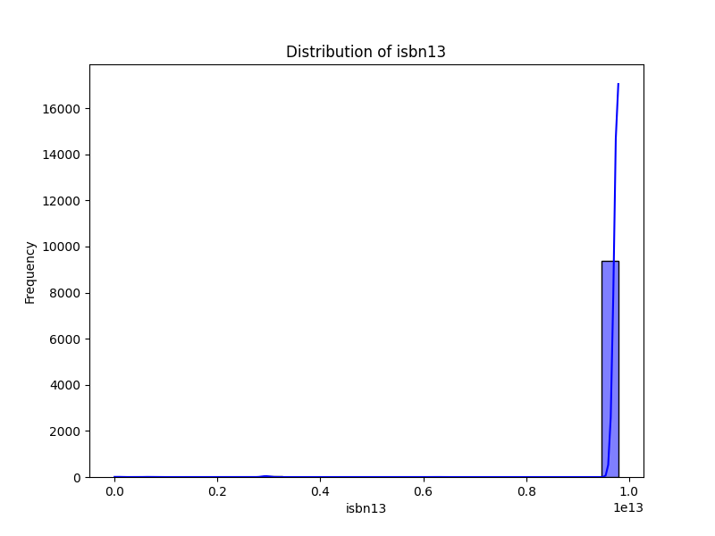
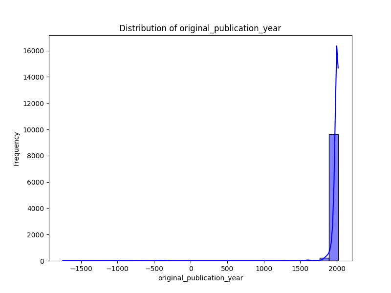
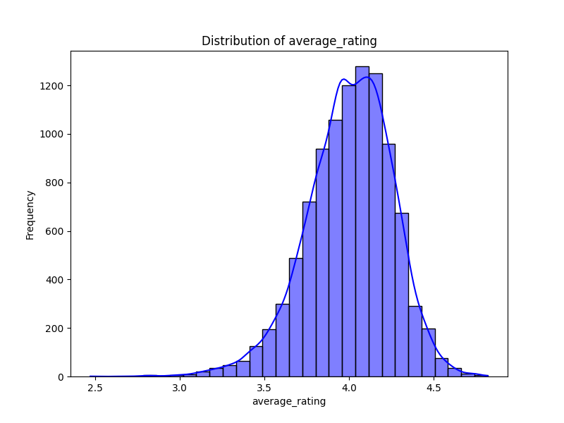
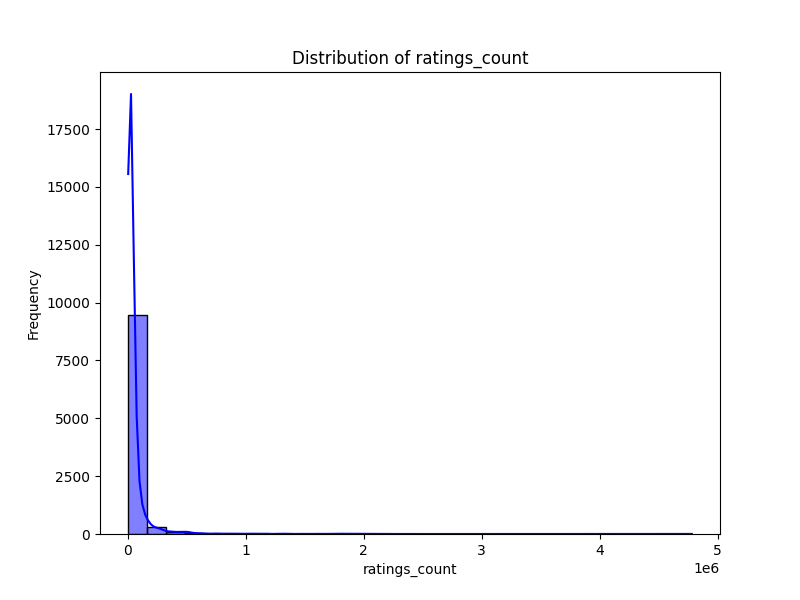
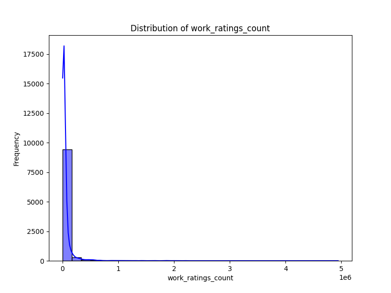
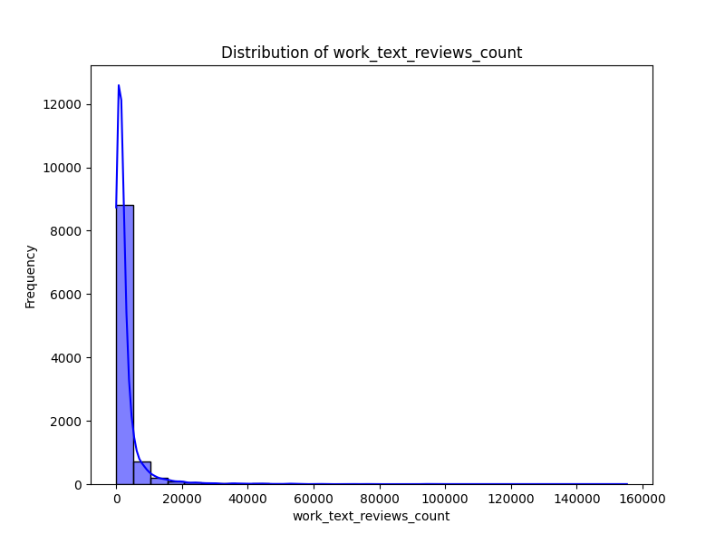
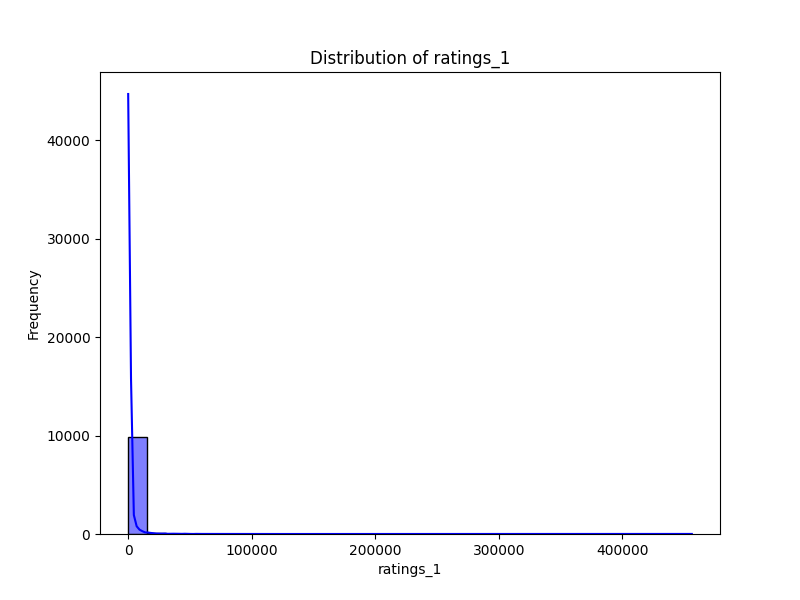
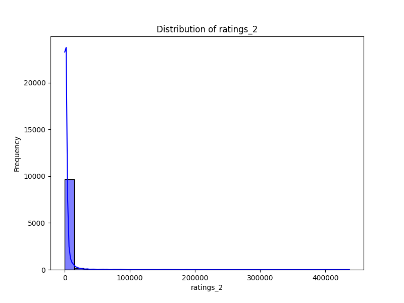
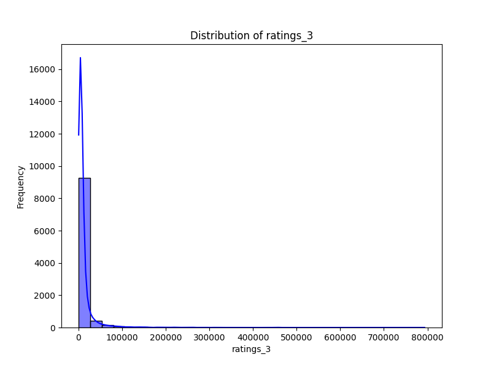
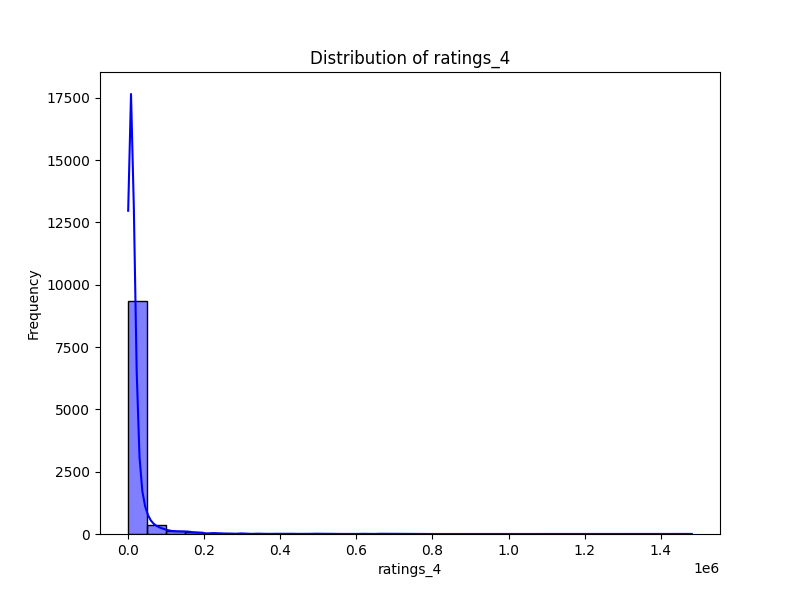
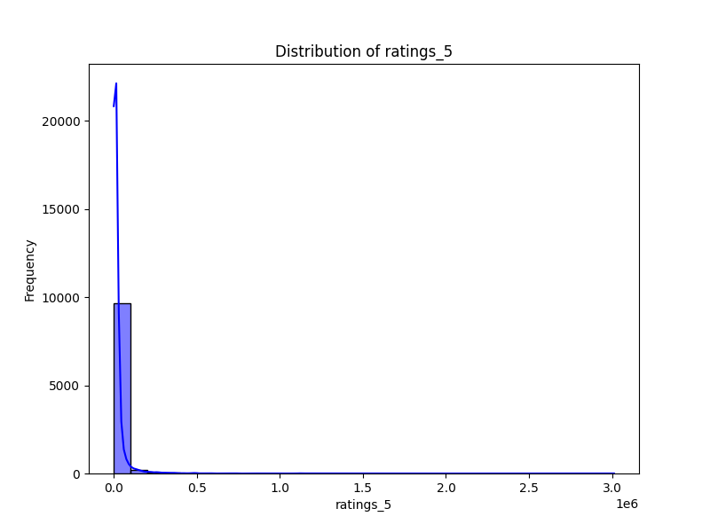
