# Automated Data Analysis Report

## Introduction
This is an automated analysis of the dataset, providing summary statistics, visualizations, and insights from the data.

## Dataset Overview
- **Rows**: 2363
- **Columns**: 11
- **Missing Values**:
Country name                          0
year                                  0
Life Ladder                           0
Log GDP per capita                   28
Social support                       13
Healthy life expectancy at birth     63
Freedom to make life choices         36
Generosity                           81
Perceptions of corruption           125
Positive affect                      24
Negative affect                      16

## Summary Statistics
|                                  |   count |   unique | top     |   freq |           mean |         std |      min |       25% |       50% |        75% |      max |
|:---------------------------------|--------:|---------:|:--------|-------:|---------------:|------------:|---------:|----------:|----------:|-----------:|---------:|
| Country name                     |    2363 |      165 | Lebanon |     18 |  nan           | nan         |  nan     |  nan      |  nan      |  nan       |  nan     |
| year                             |    2363 |      nan | nan     |    nan | 2014.76        |   5.05944   | 2005     | 2011      | 2015      | 2019       | 2023     |
| Life Ladder                      |    2363 |      nan | nan     |    nan |    5.48357     |   1.12552   |    1.281 |    4.647  |    5.449  |    6.3235  |    8.019 |
| Log GDP per capita               |    2335 |      nan | nan     |    nan |    9.39967     |   1.15207   |    5.527 |    8.5065 |    9.503  |   10.3925  |   11.676 |
| Social support                   |    2350 |      nan | nan     |    nan |    0.809369    |   0.121212  |    0.228 |    0.744  |    0.8345 |    0.904   |    0.987 |
| Healthy life expectancy at birth |    2300 |      nan | nan     |    nan |   63.4018      |   6.84264   |    6.72  |   59.195  |   65.1    |   68.5525  |   74.6   |
| Freedom to make life choices     |    2327 |      nan | nan     |    nan |    0.750282    |   0.139357  |    0.228 |    0.661  |    0.771  |    0.862   |    0.985 |
| Generosity                       |    2282 |      nan | nan     |    nan |    9.77213e-05 |   0.161388  |   -0.34  |   -0.112  |   -0.022  |    0.09375 |    0.7   |
| Perceptions of corruption        |    2238 |      nan | nan     |    nan |    0.743971    |   0.184865  |    0.035 |    0.687  |    0.7985 |    0.86775 |    0.983 |
| Positive affect                  |    2339 |      nan | nan     |    nan |    0.651882    |   0.10624   |    0.179 |    0.572  |    0.663  |    0.737   |    0.884 |
| Negative affect                  |    2347 |      nan | nan     |    nan |    0.273151    |   0.0871311 |    0.083 |    0.209  |    0.262  |    0.326   |    0.705 |

## Key Insights
The dataset provided encompasses various indicators related to the well-being and life satisfaction of individuals across different countries over time. Here’s an analysis of the data, highlighting trends, outliers, and relationships:

### 1. **Missing Values**
   - The dataset contains several missing values, particularly in the columns for **Generosity** (81 missing), **Perceptions of corruption** (125 missing), and **Healthy life expectancy at birth** (63 missing). These high counts of missing values may impact the analysis, particularly in assessing the overall well-being and satisfaction of countries due to the importance of these indicators.

### 2. **Life Ladder Trends**
   - The **Life Ladder** is a subjective measure of well-being, and analyzing its trends over years for specific countries can reveal significant insights. 
   - For instance, in Afghanistan (as per the sample), there are fluctuations in the Life Ladder from 2008 to 2012, with a notable peak in 2009 (4.402) and a drop in 2011 (3.832). This suggests that various socio-political factors could have influenced life satisfaction during these years.

### 3. **Economic Indicators**
   - The **Log GDP per capita** is often correlated with the Life Ladder. Generally, higher GDP per capita correlates with higher life satisfaction. An analysis of countries with missing GDP values could skew this relationship, making it vital to address those missing entries.
   - In the provided sample, GDP per capita appears to increase slightly over the years, which may contribute to life satisfaction improvements, but this needs to be validated against the Life Ladder scores.

### 4. **Social Support**
   - **Social support** is another critical indicator that shows a consistent trend in contributing to life satisfaction. For instance, in the sample from Afghanistan, social support scores varied, showing a potential correlation with the fluctuations in the Life Ladder.

### 5. **Freedom to Make Life Choices**
   - The variable **Freedom to make life choices** is crucial for individual satisfaction. In the sample, this metric shows a downward trend in Afghanistan from 2008 to 2011, coinciding with the fluctuations in the Life Ladder. It indicates that as people's perception of their freedom diminishes, their life satisfaction might also decline.

### 6. **Perceptions of Corruption**
   - **Perceptions of corruption** have a significant negative impact on life satisfaction. The sample data shows that higher perceptions of corruption correspond to lower life satisfaction (as seen in the years with higher Life Ladder scores). Countries with high corruption perceptions may experience stagnant or declining life satisfaction.

### 7. **Positive and Negative Affect**
   - The metrics for **Positive affect** and **Negative affect** are essential in understanding the emotional well-being of the population. In the sample data, positive affect shows an overall increase and is positively associated with the Life Ladder. Conversely, negative affect appears to have a slight increase in 2010-2011, which could correlate with the drop in Life Ladder scores during those years.

### 8. **Outliers and Interesting Trends**
   - Identifying outliers in the data could provide insights into countries that have significantly higher or lower life satisfaction compared to their GDP or social support levels. For example, countries with low GDP but high Life Ladder scores could indicate strong community support or governance factors that enhance life satisfaction despite economic challenges.
   - Conversely, countries with high GDP but low Life Ladder scores might indicate issues such as inequality, lack of freedom, or high corruption.

### Conclusion
In summary, the dataset offers valuable insights into the interplay between economic factors, social support, and individual well-being. The missing values in critical indicators must be addressed to bolster the robustness of the analysis. Future analyses should focus on correlation coefficients between these variables, time-series analyses to uncover long-term trends, and possibly imputation methods for dealing with the missing data to gain a clearer understanding of the relationships at play.

## Visualizations
### Correlation Matrix
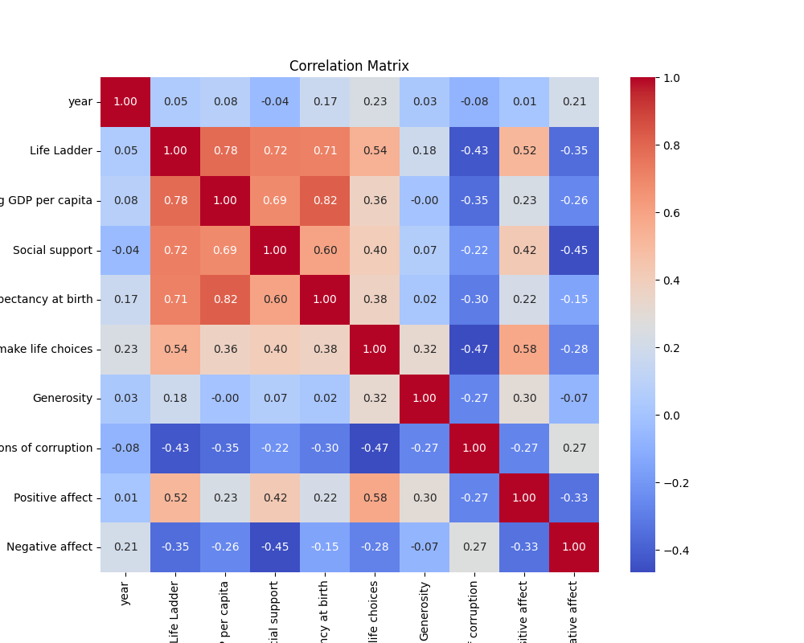

### Distributions
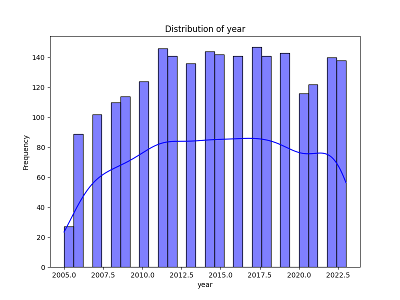
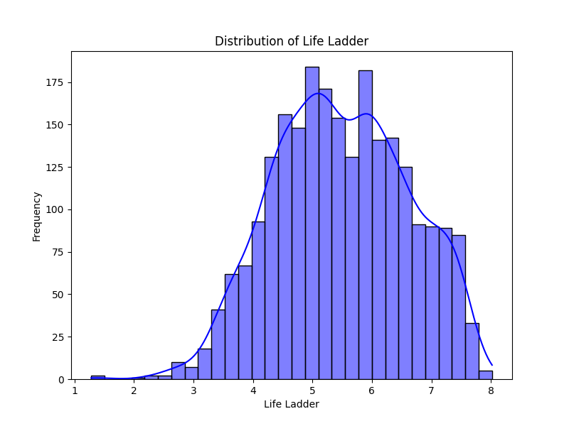
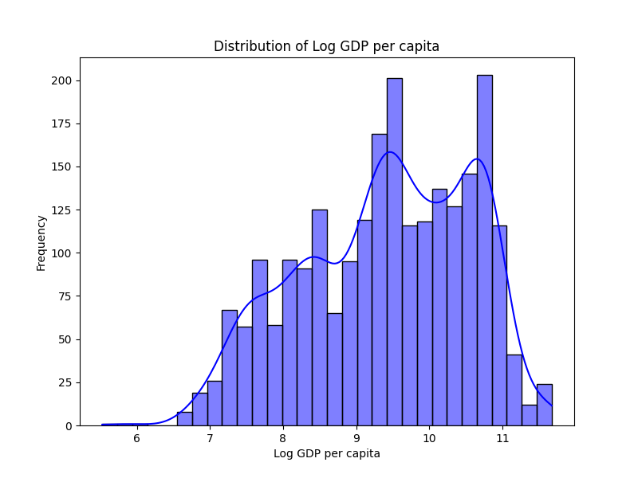
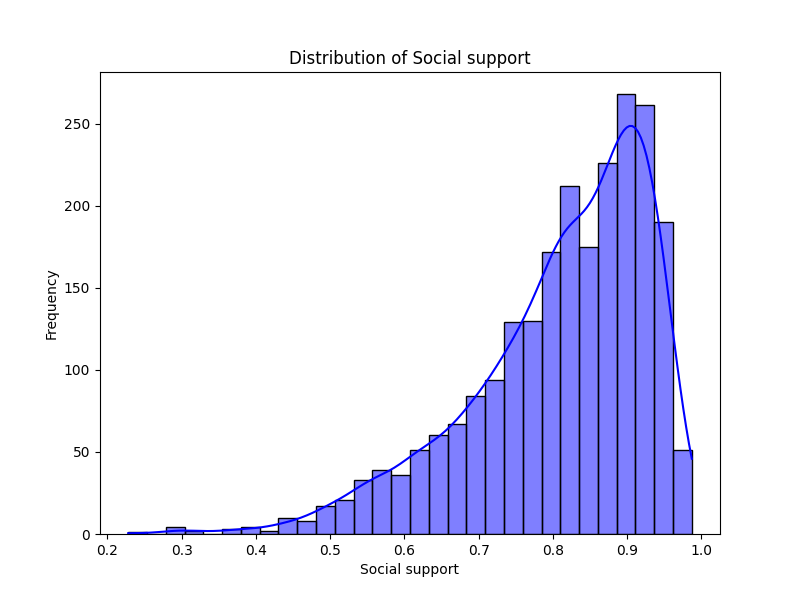
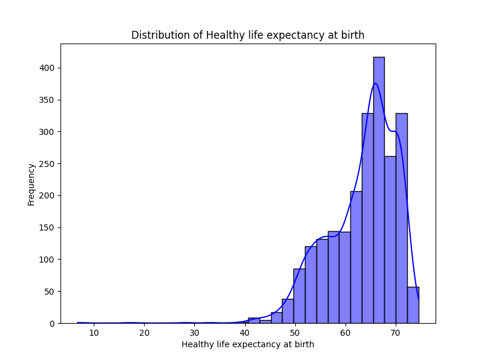
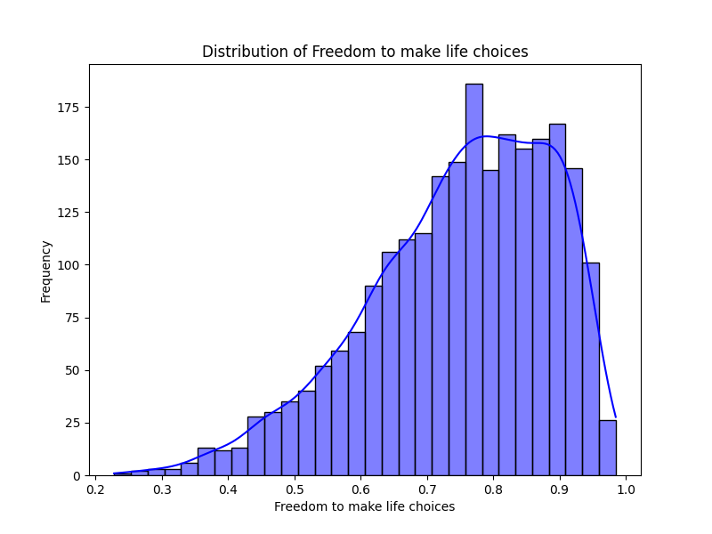
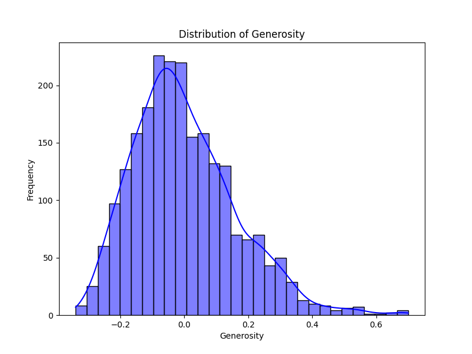
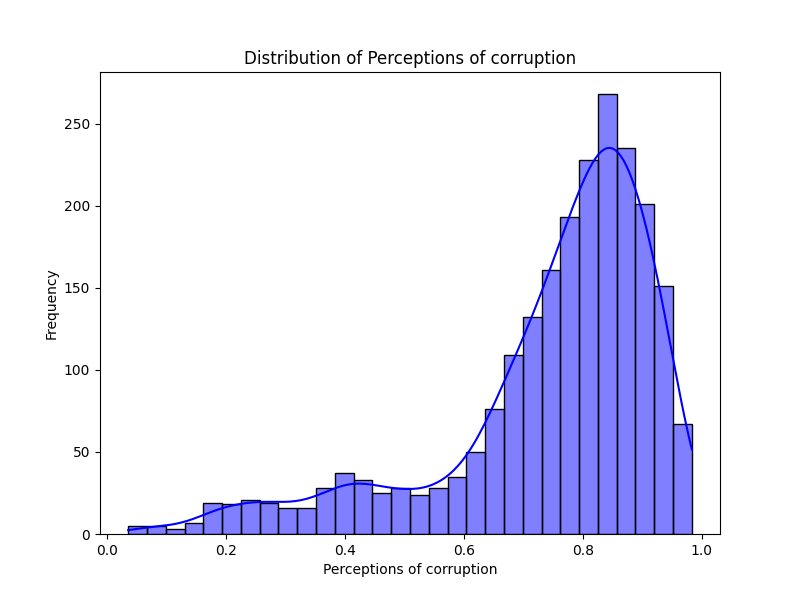
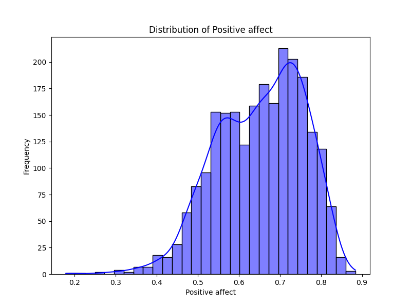
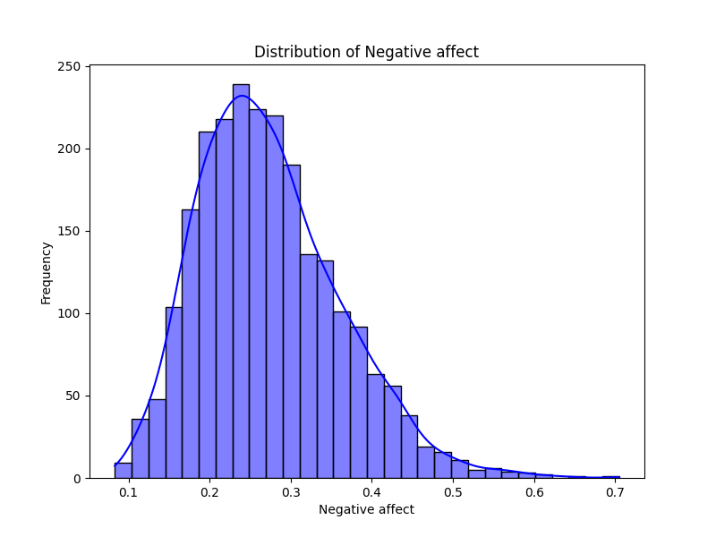
