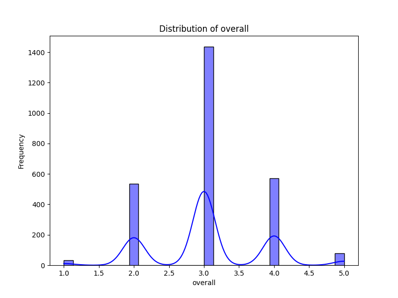
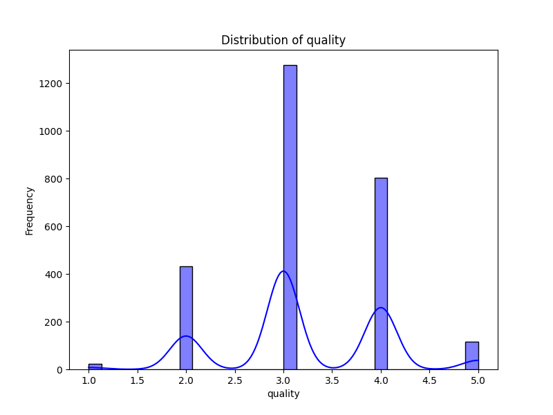
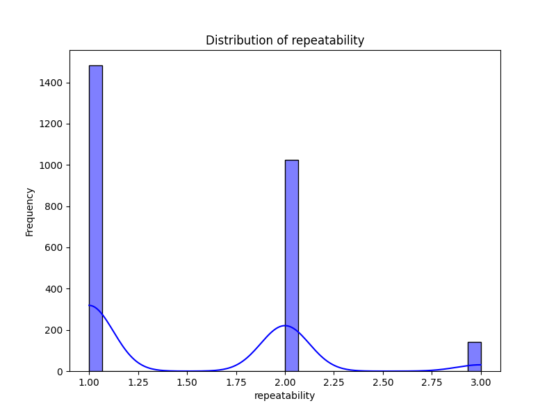

# Automated Analysis Report

## Dataset Overview
- **Rows**: 2652
- **Columns**: 8
- **Missing Values**:
date              99
language           0
type               0
title              0
by               262
overall            0
quality            0
repeatability      0

## Key Insights
### Data Analysis Insights

1. **Data Overview**:
   - The dataset consists of movie reviews characterized by various attributes such as date, language, type, title, contributors, and ratings (overall, quality, repeatability).
   - There are missing values primarily in the 'by' column (262 instances) and the 'date' column (99 instances), which may affect analysis and interpretation.

2. **Language Distribution**:
   - The dataset features movies predominantly in Tamil and Telugu. Analyzing the count of reviews per language may reveal audience preferences and regional popularity.

3. **Rating Analysis**:
   - Ratings for 'overall', 'quality', and 'repeatability' are all on a scale where higher values indicate better reception. 
   - The overall average ratings can be computed to assess general sentiment. For instance, the sample data shows varied overall ratings (ranging from 2 to 4), indicating a mix of positive and negative feedback.

4. **Type and Genre Insights**:
   - The dataset is currently focused on movies, which suggests a homogeneous type distribution that may limit genre-specific analysis. If additional types (e.g., series, documentaries) were included, it would enrich insights.

5. **Contributor Analysis**:
   - The 'by' column has a significant number of missing values. Analyzing the contributions of various actors and directors could reveal trends in performance and their impact on ratings.
   - For instance, notable actors like Rajnikanth and Vijay appear in the sample, suggesting a potential correlation between star power and overall ratings.

### Trends and Relationships

1. **Overall vs. Quality Ratings**:
   - A correlation analysis between 'overall' and 'quality' ratings can determine how strongly perceived quality affects overall satisfaction. While generally expected to be positively correlated, exploring any deviations could uncover interesting insights.

2. **Temporal Trends**:
   - Analyzing the 'date' column can reveal trends over time, such as whether movie ratings are improving or declining. Seasonality (e.g., holidays, festivals) could also affect movie performance, necessitating a time series analysis.

3. **Outliers in Ratings**:
   - Identifying movies with exceptionally high or low ratings compared to their peers can provide insights into unique cases. For instance, a movie that received a low overall rating but high quality rating could indicate a disconnect between audience expectations and execution.

4. **Language Performance**:
   - Comparing average ratings across languages may highlight regional preferences or differences in production quality. For example, if Tamil movies show consistently higher ratings than Telugu movies, this could indicate a stronger appreciation for Tamil cinema within the dataset.

### Recommendations for Further Analysis

- **Data Cleaning**: Address missing values, particularly in the 'by' column, to preserve the integrity of contributor analysis.
- **Expand Dataset**: If feasible, include additional entries or genres to enhance the diversity of the dataset.
- **Detailed Visualization**: Use visualizations (like box plots or scatter plots) to better illustrate relationships and trends, particularly for ratings and language distributions.
- **Advanced Analytics**: Consider implementing machine learning techniques to predict ratings based on features like language, type, and contributors for future entries.

- Summary statistics provide an overview of the dataset, including mean, median, and standard deviation.
- Missing values are identified and counted to assess data quality.
- Correlation matrices reveal relationships between numerical variables.
- Distribution plots help identify outliers and data distribution.
- Outliers can be visually inspected from the distribution plots and addressed.
- Hierarchical patterns or clustering opportunities could be explored for grouping data points.
- Additional analyses can involve advanced clustering techniques such as KMeans or DBSCAN.

## Visualizations
### Correlation Matrix

### Distributions

